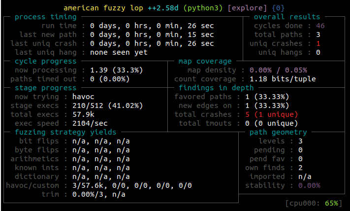

# frida-js-afl-instr

An example on how to do performant in-memory fuzzing with AFL++ and Frida.
Currently works only on Linux, not Android.

To run use the same option of unicorn_mode, `-U`.

`afl-fuzz -U -i in -o out -m none -- python3 frida_driver.py`

If you want to adapt this script to other binaries that are not the simple `test` binary shipped within this repo you have to hack a bit `fuzz.py` to use your binary and `frida_script.js` to correctly call your target function.

You can also use showmap to test the instrumentation (and run frida_driver.py).

`afl-showmap -U -o - -- python3 frida_driver.py`

### Screenshots

